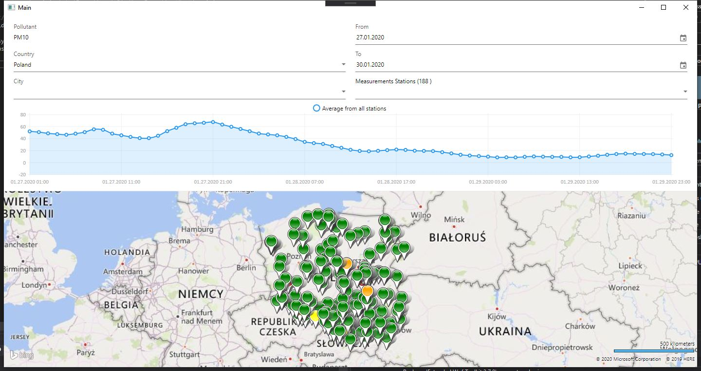

# Air Pollution App (WPF)

> Autorzy: _Łukasz Kuciel_ & _Piotr Balon_
> Wersja: _2020-01-25_
---

## Projekt aplikacji

Aplikacja ma na celu wyświetlenie aktualnego stanu powietrza - dane pobierane za pomocą API z serwisu [openaq](https://openaq.org).
Projekt oparliśmy na naszej wiedzy oraz pomocach internetowych.

## Wykorzystane technologie / narzędzia:

* Framework - .NET Core 3.1
* GUI - XAML
* Bing MapControl for WPF
* Fluent WPF
* LiveCharts WPF
* Caliburn Micro

## Wygląd aplikacji

